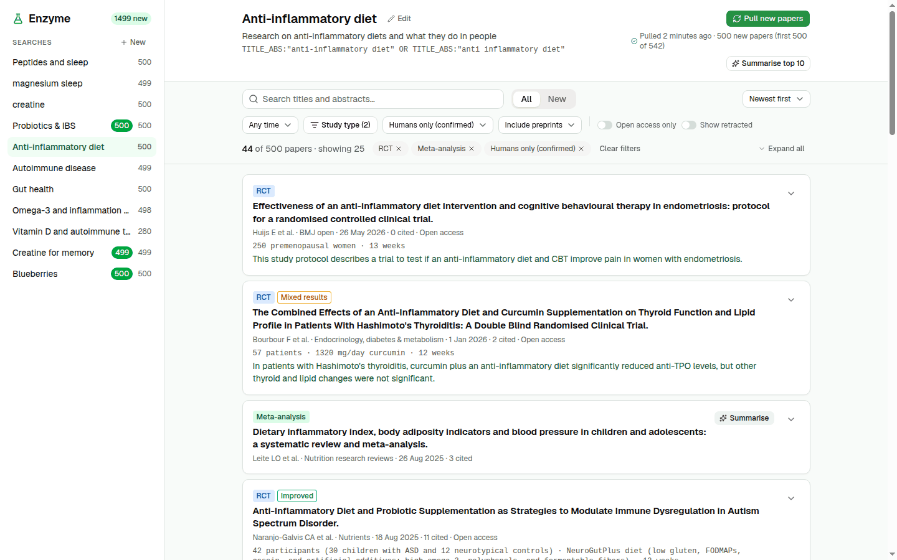
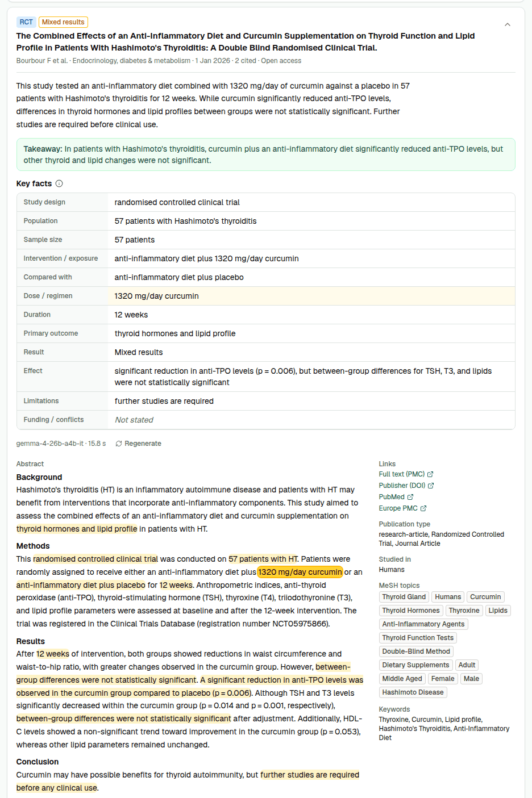
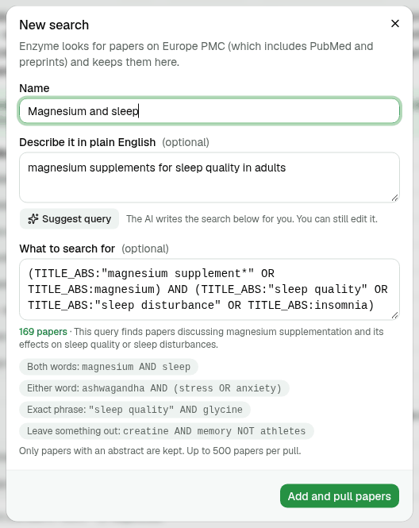

# Enzyme

An enzyme breaks big molecules down into pieces the body can use. Enzyme the app does the same for
research papers: it gathers the new studies on the topics you follow and breaks each one down into
a short, checkable set of key facts.

Built in one weekend for the DEV Hacktoberfest 2026 Weekend Challenge, "Build for a Friend".



## Who it's for

My friend has a master's in biochemistry, works in the field, and wants to start an honest
supplement company and share evidence-based science online. Her problem is keeping up: every week
brings new papers on the topics she cares about, many of them off-topic, animal studies or weak
designs, and each one a dense abstract to read before you know if it matters.

General tools for this already exist. Enzyme is built for her: her topics (anti-inflammatory diet,
autoimmune disease, gut health), her filters (human studies, RCTs and meta-analyses first), and
facts she can check against the abstract herself rather than a summary she has to trust.

## What it does

- **Saved searches for her topics.** Each search is a Europe PMC query (Europe PMC includes PubMed
  and preprints). "Pull papers" fetches up to 500 matching papers with an abstract into a local
  library, with live progress. Pull again later and only the new papers are marked **New**.
- **Describe a topic in plain English, get a query.** She doesn't need to know Europe PMC's query
  syntax. "Suggest query" asks an AI agent to write one; the agent checks real hit counts with a
  tool and narrows or widens until the search returns a readable number of papers (50 to 5,000).
  She can still edit the query by hand.
- **Filters that don't use AI.** Study type (meta-analysis, systematic review, RCT, clinical trial,
  observational, review, case report), humans only, date, preprints, open access, retracted papers
  hidden, keyword search over titles and abstracts, and sorting by newest, strongest evidence or most cited. These
  come from the paper's own metadata (publication types, MeSH terms), so they are exact and free.
- **Key facts for each paper (the "study card").** One click asks an open-weight model (Gemma 4) to
  pull out 12 facts: design, population, sample size, intervention, comparator, dose, duration,
  primary outcome, result, effect, limitations and funding. Every fact comes with the exact words
  from the abstract that state it, and the app checks those words really are in the abstract.
  Facts the abstract doesn't state are shown as "Not stated" rather than guessed. Hover a fact and
  its quote lights up in the abstract.
- **A plain-language summary and a one-line takeaway**, written only from the extracted facts.
- **"Summarise top 10"** summarises the first ten papers in the current filtered feed, four at a
  time, so the feed fills in with sample sizes, doses and takeaways in under a minute.





## Quick start

You need Node.js 24 or newer and pnpm (`corepack enable pnpm` installs it).

```sh
git clone https://github.com/vytasgavelis/enzyme.git
cd enzyme
cp .env.example .env    # then paste your key into GOOGLE_GENERATIVE_AI_API_KEY (optional, see below)
pnpm i
pnpm db:migrate         # creates data/enzyme.db
pnpm seed               # adds her six saved searches
pnpm dev                # API on :3210, web app on http://localhost:5173
```

Open http://localhost:5173, pick a search and press **Pull papers**. On a fresh clone the whole
sequence took under 15 seconds (install included), plus about 10 seconds per pull.

The model key is only needed for the AI features (key facts, summaries, Suggest query). Searches,
pulls, filters and the feed all work without it. Without a key, the AI buttons say so and tell you
which variable to set. A free key from [Google AI Studio](https://aistudio.google.com/apikey) is
enough: the free tier serves Gemma.

### The seeded searches

`pnpm seed` adds these searches with fixed queries, so it is fast, gives the same result every time
and needs no key. The queries were written by the Suggest query agent and checked by hand. Running
it again skips any search that already exists by name or by query. `pnpm seed --pull` also pulls
every search (about 40 seconds for all six).

| Search | Europe PMC query | Papers (4 Oct 2026) |
|---|---|---|
| Anti-inflammatory diet | `TITLE_ABS:"anti-inflammatory diet" OR TITLE_ABS:"anti inflammatory diet"` | 542 |
| Autoimmune disease | `TITLE:("autoimmune disease*" OR "autoimmune disorder*")` | 4,436 |
| Gut health | `TITLE:"gut health"` | 1,282 |
| Omega-3 and inflammation markers | omega-3 / EPA / DHA AND CRP / IL-6 / "inflammation marker*", in title or abstract | 1,183 |
| Probiotics for IBS | `(TITLE_ABS:probiotic* OR TITLE_ABS:probiotics) AND (TITLE_ABS:"irritable bowel syndrome" OR TITLE_ABS:IBS)` | 1,380 |
| Vitamin D and autoimmune thyroid | vitamin D / cholecalciferol AND autoimmune thyroid disease / Hashimoto / Graves, in title or abstract | 280 |

Counts are papers with an abstract. A pull keeps the first 500 in Europe PMC's relevance order.
The full queries are in
[`apps/server/src/db/seed.ts`](apps/server/src/db/seed.ts).

## Configuration

Everything is read from `.env` in the repository root. [`.env.example`](.env.example) lists all of it.

| Variable | Default | What it does |
|---|---|---|
| `GOOGLE_GENERATIVE_AI_API_KEY` | (none) | Key for Gemma on the Gemini API. Needed only for key facts, summaries and Suggest query. |
| `ENZYME_MODEL` | `google/gemma-4-26b-a4b-it` | The model, as a Mastra model-router id (`provider/model`). For example `google/gemma-4-31b-it`. Another provider needs its own key variable. |
| `PORT` | `3210` | API port. The web dev server proxies `/api` to it. |
| `WEB_PORT` | `5173` | Web dev server port. |
| `WEB_HOST` | `localhost` | Web dev server host. `0.0.0.0` makes it reachable from outside a VM. |
| `DATABASE_PATH` | `./data/enzyme.db` | The SQLite database, relative to the repository root. |
| `TRACES_PATH` | `./data/mastra.db` | Where Mastra stores agent traces (a separate SQLite file). |

For UI work without the API, `VITE_MOCK_API=1 pnpm dev` runs the web app on built-in sample data.

## Scripts

| Command | What it does |
|---|---|
| `pnpm dev` | Runs the API and the web app, both reloading on change. |
| `pnpm db:migrate` | Creates or updates the database. The server also does this when it starts. |
| `pnpm seed [--pull]` | Adds the six saved searches above; `--pull` also fetches their papers. |
| `pnpm epmc "<query>" [--max N] [--json]` | Runs a Europe PMC query and prints the papers and the hit count. Handy for trying a query before saving it. |
| `pnpm cards <paperId>... [--model id]` | Generates key facts for papers in the library and prints them with their quotes and check marks. |
| `pnpm bench [paperId...] [--models a,b]` | Compares models on the same papers with Mastra scorers. Writes a report to `bench/results/`. Never changes the database. |
| `pnpm traces [--limit N] [--agent name] [--full]` | Prints recent agent runs from the trace store: each model call with tokens and latency, each tool call with its input and output. |
| `pnpm test`, `pnpm lint`, `pnpm typecheck` | Vitest, Biome and TypeScript over the whole repository. |
| `pnpm db:generate`, `pnpm db:studio` | Drizzle Kit: write a migration after editing `apps/server/src/db/schema.ts`; browse the database. |

## How it works

```
apps/web          React + Vite, Tailwind + shadcn/ui, TanStack Query, typed Hono RPC client
   │  /api
apps/server       Hono API
   ├─ sources/    Europe PMC client (cursor paging, retries, rate limit)
   ├─ db/         SQLite via Drizzle + better-sqlite3, FTS5 full-text index, migrations
   ├─ pull.ts     a pull: fetch → merge into the library → link to the search, with progress
   ├─ ai/         Mastra instance with two Gemma agents and local tracing
   └─ bench/      Mastra scorers for the model comparison
packages/shared   Zod schemas and logic used by both sides (API contract, study card,
                  quote check, evidence tiers)
```

- **One TypeScript codebase.** The API contract is Zod schemas in `packages/shared`; the web app
  calls the API through Hono's typed client, so a changed field is a type error on both sides.
- **Local and simple storage.** One SQLite file. Papers are merged across sources by PMID, then DOI,
  then source id, so a paper found by two searches is stored once. An FTS5 index over plain-text
  title and abstract powers the keyword search. Every generated card is kept, not overwritten, so
  models can be compared on the same paper later.
- **Metadata first, AI second.** Study type, species and retraction come from publication types and
  MeSH terms (`packages/shared/src/evidence.ts`). The model is used only where metadata can't help:
  reading the abstract, and turning a plain-English topic into query syntax.
- **Two Mastra agents on Gemma 4.**
  - *Study card agent* (`apps/server/src/ai/card-agent.ts`): title and abstract in, 12 facts with
    quotes plus a takeaway and summary out, as JSON validated against a Zod schema. The server then
    checks every quote against the abstract (`checkCard` in `packages/shared/src/card.ts`) and marks
    each fact as stated, unknown or suspect.
  - *Query writer agent* (`apps/server/src/ai/query-agent.ts`): gets a tool that counts Europe PMC
    hits for a draft query, and revises until the count is in a useful range. Our code keeps the
    best checked query in case the agent's last answer is worse.
- **Tracing.** Every agent run is traced to a local libSQL file (agent run → model steps → tool
  calls, with tokens and timing). `pnpm traces` prints them. Nothing leaves the machine except the
  model calls themselves.

A few Gemma 4 quirks shaped the agent setup. Notes are in the comments of `card-agent.ts`. In short:
the native JSON-schema mode corrupted values, so the prompt carries its own JSON template and Mastra
validates the reply; thinking is set to "minimal" because full thinking took over a minute per
paper; and every call has a timeout.

## Choosing the model

The plan was to benchmark rather than assume. `pnpm bench` ran both Gemma 4 models the Gemini API
serves on the same 12 papers about inflammation, autoimmunity and gut health, scored with Mastra
scorers, each model's summaries judged by the other model:

| | Gemma 4 26B-A4B | Gemma 4 31B |
|---|---|---|
| Cards produced | 11 / 12 | 10 / 12 (2 timeouts) |
| Quotes found word for word in the abstract | 99% | 99% |
| Said "unknown" instead of guessing | 98% | 100% |
| Summary claims supported by the facts | 84% | 69% |
| Median time per card | 14.2 s | 49.4 s |

Both extract equally well. 26B-A4B (a mixture-of-experts model with about 4B active parameters) is
3.5 times faster and never timed out, so it is the default. The full report, with how each score
works and its caveats, is in [`bench/results/gemma-26b-vs-31b.md`](bench/results/gemma-26b-vs-31b.md).

## Known limitations

- Europe PMC searches full text where it has it, so broad queries pull some off-topic papers. The
  Suggest query agent prefers title and abstract fields for this reason.
- Some Europe PMC titles arrive with HTML escaped twice and show tags like `&lt;i&gt;` literally.
- Most papers from the last few months have no MeSH terms yet, so "Humans only (confirmed)" hides
  them. "Hide animal-only" keeps them.
- The model sometimes returns a card that fails validation (about 1 paper in 12 in the benchmark).
  The paper shows an error and "Summarise" can be pressed again; for some papers it fails every time.
- Pulls run inside the API process. A pull that is running when the server stops is marked failed
  on the next start; press "Pull new papers" again.
- A pull takes the first 500 papers in Europe PMC's relevance order, not the newest 500. For a
  search with more hits than that, narrow the query.
- It is a local app for one person: no accounts, no deployment.

## Hacktoberfest

This repository was started on 2 October 2026 for the DEV Hacktoberfest 2026 Weekend Challenge
("Build for a Friend"). The submission deadline is 5 October 2026, 06:59 UTC (5:59 PM in
Melbourne). Work continues after the deadline; per the challenge rules, every commit made after it
is listed below.

### Commits after the deadline

None yet.

<!-- One line per commit after 2026-10-05 06:59 UTC: `short-sha` date, what changed. -->

## License

[MIT](LICENSE)
