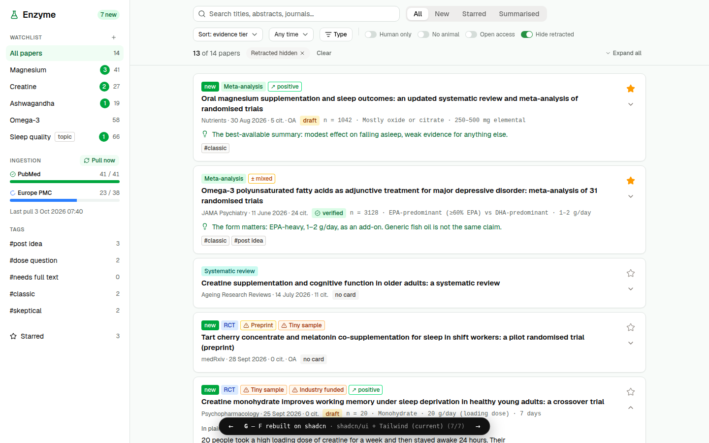

# UI reference: variant G (PROTOTYPE, do not merge)

This branch exists only as a **visual and structural reference for T-6** (web UI: searches,
pull, feed, paper detail). It is not wired into the app: there is no route, and nothing imports
these files. Rebuild the real screens against the real API; borrow from this code, don't ship it.

## Decision

- **Stack:** stay on shadcn/ui + Tailwind v4 (already in the scaffold). No other component library.
  Mantine, Ant Design, Radix Themes and a Tailwind-only editorial look were tried and rejected.
- **Layout:** left sidebar (saved searches/watchlist with new counts, the selected search's
  natural-language intent and generated PubMed query, ingestion progress with "Pull now", tags,
  starred), main area with a sticky toolbar (search, All/New/Starred/Summarised tabs, sort, date
  preset, pub-type popover, switches, active-filter chips, expand/collapse all) and a feed.
- **Feed rows:** compact by default (badges, title, journal · date · citations · OA, card status,
  key numbers in mono, one-line takeaway in green). Clicking opens the row in place: plain-language
  summary, takeaway callout, **"Key facts"** (the study card, with an ⓘ tooltip explaining it),
  abstract with provenance highlighting. No coloured left border on rows (user rejected it).
- **Colour carries meaning:** tier badge (meta-analysis green, systematic review teal, RCT blue,
  observational grey, animal orange), red-flag badges (retracted solid red + struck title, others
  orange/amber), result-direction outline badge, verified green / draft amber.
- **Wording:** show "Key facts" to the user; keep "study card" as the internal/code term.

## Files

| File | What to take from it |
|---|---|
| `VariantG.tsx` | Layout, `Pill` tone classes, `THEME` token overrides (green accent, sage neutrals), sidebar row, paper row, key-facts panel with provenance hover/pin |
| `mock.ts` | Mock data shapes used by the screen (placeholder; the real schema comes from T-3/T-5) |
| `variant-g.png` | Screenshot at 1440×900 |
| `components/ui/*` (alert, checkbox, popover, progress, select, separator, switch, tabs, textarea, tooltip) | shadcn components G uses that master didn't have; regenerate with `pnpm --filter @enzyme/web exec shadcn add …` rather than copying if versions moved |

## Notes for the T-6 implementer

- Move `THEME` values into `apps/web/src/index.css` (`:root` tokens) instead of an inline style.
- Promote `Pill` to a proper component (e.g. extra `badge` variants via `cva`).
- Biome's a11y rule needs `htmlFor`/`id` on labels wrapping Radix `Switch`/`Checkbox`.
- T-6 only needs metadata badges; key facts, summary and result direction arrive with T-7/T-8.
- Full comparison of all seven variants (screenshots + trade-offs):
  https://claude.ai/artifact/VpHYjFVC7DURN4uxv6b8sv
